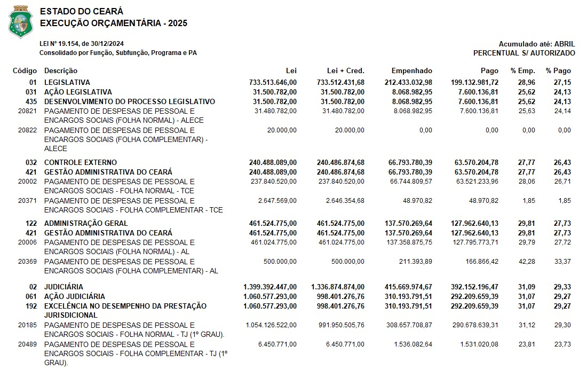
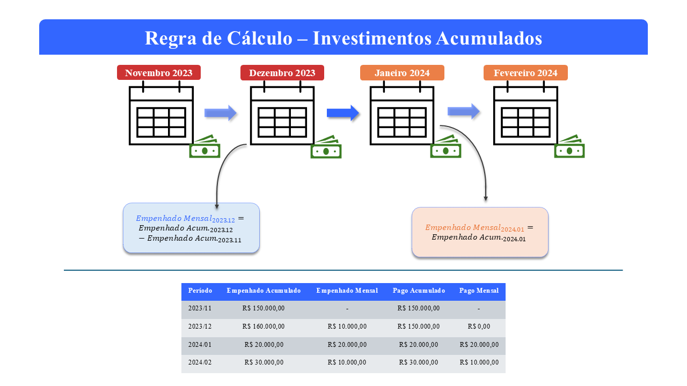

## Objetivo e Estrutura dos Dados

<p>
|       A rotina desenvolvida visa realizar realizar a devida padronização nos dados de investimentos por função que municiam os modelos trabalhados no projeto. 

|       A imagem a seguir representa a estrutura dos dados disponibilizados em cada uma das planilhas baixadas na página do [SIOF](https://planejamento.seplag.ce.gov.br/siofconsulta/Paginas/frm_consulta_execucao.aspx). Cada planilha representa um **Tipo** de investimento: Corrente, Pessoal, Equipamentos, Obras e Total. Em termos de informações efetivas, cada planilha contém oito campos. Destes, as colunas interesse são:
*   Código
*   Descrição
*   Empenhado
*   Pago

|       No campo Código, os investimentos estão classificados em Função, Subfunção, Programa e Projeto/Atividade. Para fins da pesquisa, apenas a primeira classificação interessa. 
|       Levando em conta os pontos mencionados e que os dados são cumulativos, o objetivo dessa rotina é coletar as informações referente a Função considerando somente os valores de investimentos Empenhado e Pago. Os tópicos a seguir detalham cada etapa da rotina.
</p>

{width=100%}


## Bibliotecas e Arquivos na Pasta

<p>
|       Para executação dessa rotina, duas bibliotecas foram utilizadas:

*   [pandas](https://pandas.pydata.org/docs/index.html): bilbioteca para manipulação, limpeza e análise de dados.
*   [os](https://docs.python.org/3/library/os.html): biblioteca padrão do python que permite interagir com o sistema operacional.

|       Importadas as devidas bibliotecas, os arquivos que serão trabalhados são devidamente mapeados por meio da função **listdir** da biblioteca **os**. Nessa etapa também é criado um *dataframe*, **dataset_full**, que irá armazenar todo o conjunto de dados final.
</p>

```{python}
#| label: Bibliotecas e Arquivos
#| echo: True
#| eval: True

# =================== #
# === Bibliotecas === #
# =================== #
import pandas as pd
import os


# ========================= #
# === Arquivos de Dados === #
# ========================= #
folder_files = os.listdir('Dataset/Investimentos_Funcao/')
dataset_full = pd.DataFrame()

# --- Prints --- #
print(*folder_files[0:10], sep = '\n')
```


## Processamento de Dados 

<p>
|       Nesta etapa, uma estrutura *loop* é utilizada realizar a manipulação da rotina, onde cada etapa do tratamento é executado em cada conjunto de informações contidos nas planilhas.
|       Na leitura dos arquivos, somente as colunas de interesse são coletadas. Além disso, toda e qualquer linha nula é removida desse conjunto. Esse conjunto de dados remodelado recebe o nome de **dataset**.
|       Ao **dataset** são acrescidos quatro novos campos representando, respectivamente, i) periodo, ii) tipo de investimento, iii) ano, e iv) mês. Tais informações são extraídas justamente do nome de cada arquivo processado^[Tal fato só é possível devido a padronização adotada para o nome dos arquivos. Para distinguir dos investimentos por programa, os arquivos recebem o prefiro **F_**. Por exemplo, para os investimentos em Equipamentos no período de Março de 2020, teria-se **F_MAR_2020_EQUIP.xlsx**.].
|       Após esses tratamentos iniciais, algumas linhas de comando são responsáveis por duas partes cruciais do procedimento. Primeiramente, são identificas e filtradas somentes as linhas referente a cujo código corresponde a Função. Dado a estrutura de looping, a segunda parte diz respeito a regra de acumulação das informações. **Cada planilha que passa pelo procedimento rerpresenta um dataset que contribui para um dataframe final chamado dataset_full contendo todas as informações por ano, mês e tipo de investimento e função**.
</p>

```{python}
#| label: Processamento de Dados
#| echo: True
#| eval: True


# ============================== #
# === Processamento de Dados === #
# ============================== #
for x in range(len(folder_files)):
    
    # --- Leitura de arquivos --- #
    dataset = pd.read_excel(io = 'Dataset/Investimentos_Funcao/' + folder_files[x],
                            header = 10,
                            usecols= 'C, F, K, N',
                            dtype = {'Código':str})
    
    # --- Removendo valores vazios --- #
    dataset = dataset.dropna()                                                                
    
    # --- Adicionando colunas --- #
    dataset = dataset.assign(periodo = folder_files[x][6:10] + '/' + folder_files[x][2:5],
                             tipo = folder_files[x][11:16],
                             ano = folder_files[x][6:10],
                             mes = folder_files[x][2:5])    
    
    # --- Algumas substituições --- #
    replacements = {'JAN':'01', 'FEV':'02', 'MAR':'03', 'ABR':'04', 'MAI':'05', 'JUN':'06', 'JUL':'07', 'AGO':'08', 'SET':'09', 'OUT':'10', 'NOV':'11', 'DEZ':'12'}
    for old, new in replacements.items():
        dataset['mes'] = dataset['mes'].replace(old,new)
    
    # --- Identificando linhas correspondentes a Função --- #
    function_flag = dataset['Código'].str.len() == 2
            
    # --- Selecionando somente as linhas que se encaixam na condição anterior --- #
    dataset = dataset[function_flag]

    # --- Reordenando e renomeando --- #
    dataset = dataset.reindex(columns = ['periodo', 'ano', 'mes', 'tipo', 'Código', 'Descrição', 'Empenhado', 'Pago'])
    dataset.rename(columns = {'Descrição':'funcao', 'Código':'codigo', 'Empenhado':'empenhado', 'Pago':'pago'}, inplace = True)
    
    # --- Empilhando dataset's no dataset_full --- #
    if x == 0:    
        dataset_full = dataset
    else:
        dataset_full = pd.concat([dataset_full, dataset])
print(dataset_full.head(10))
```


## Ajuste para Dados Cumulativos

<p>
|       Nessa seção da rotina, o objetivo principal é chegar ao investimento efetivo que se deu em determinado período. Dessa forma, a ideia é sempre tomar a diferença entre os periodos adotando a seguinte regra:
</p>

$$
invest_t = invest\_acum_t - invest\_acum_t-1    \qquad(t \neq 1)
$$

<p>
|       É interessante ressaltar que para chegar nesse cálculo o dataframe **dataset_full** precisa estar devidamente ordenado, evitando assim variações entre períodos, tipos de investimento e mesmo funções diferentes. Em vista dessa necessidade, a função [**sort_values**](https://pandas.pydata.org/docs/reference/api/pandas.DataFrame.sort_values.html) desempenha esse papel de ordenamento, onde a seguinte ordem é adotada:

* Função
* Tipo
* Ano
* Mês

No **dataset_full** duas novas colunas representando o investimento mensal, **empenhado_mensal** e **pago_mensal**, são adicionadas, ao passo que os campos **empenhado** e **pago** passam a se chamar **empenhado_acumulado** e **pago_acumulado**.

|       Para valores que representam o mês de janeiro, uma regra em looping foi gerada. Uma vez que os dados estão devidamente ordenados e não há possibilidade alguma de conflito de informações, ao comparar a linha atual com a anterior, se a diferença entre os meses for superior a 1, então tem-se a confirmação de um cenário onde a linha atual representa janeiro e a linha anterior representa dezembro do ano anterior. Nesse caso, a rotina entende que o valor mensal é o mesmo valor acumulado. Nos demais cenários a regra padrão é adotada. O infográfico a seguir ajuda a compreender a regra adotada.

{width=100%}
</p>


```{python}
#| label: Dados Cumulativos
#| echo: True
#| eval: True

# ======================================= #
# === Ajustes para Dados Cumulativos  === #
# ======================================= #

# --- Ordenamento --- #
dataset_full = dataset_full.sort_values(by = ['funcao', 'tipo', 'ano', 'mes']).reset_index(drop = True)

# --- Ajuste nos dados cumulativos --- #
dataset_full['empenhado_mensal'] = dataset_full['empenhado'] - dataset_full['empenhado'].shift(1)       # Inserting adjusted values
dataset_full['pago_mensal'] = dataset_full['pago'] - dataset_full['pago'].shift(1)                      # Inserting adjusted values

# --- Looping de ajuste para valores com datas truncadas --- #
for i in range(len(dataset_full)):
    if i == 0:
        dataset_full.loc[0, 'empenhado_mensal'] = dataset_full.loc[0, 'empenhado']
        dataset_full.loc[0, 'pago_mensal'] = dataset_full.loc[0, 'pago']
    if i != 0 and int(dataset_full.loc[i, 'mes']) - int(dataset_full.loc[i-1, 'mes']) != 1:
        dataset_full.loc[i, 'empenhado_mensal'] = dataset_full.loc[i, 'empenhado']
        dataset_full.loc[i, 'pago_mensal'] = dataset_full.loc[i, 'pago']

# --- Renomeando colunas --- #
dataset_full.rename(columns = {'empenhado':'empenhado_acumulado', 'pago':'pago_acumulado'}, inplace = True)

# --- Prints --- #
print(dataset_full.head(10))
```


## Armazenamento dos Resultados
|       Após todo o tratamento aplicado aos dados, a base final, **dataset_full**, recebe um último tratamento antes dos dados serem finalmente armazenados em um arquivo excel (.xlsx). 
|       **A base de dados final que até então continha 10 colunas passa por uma espécie de "verticalização"^[Esse procedimento é realizado por meio da função [**melt**](https://pandas.pydata.org/docs/reference/api/pandas.melt.html).] das informações**. As colunas de valores agora são dividídas em duas colunas. Enquanto os valores em si se alinham sob uma única coluna nomeada **valor**, uma coluna nomeada **categoria** é gerada para representar a categoria de investimento que está sendo tratada. Os campos período, ano, mês, tipo, código e função permanecem como variáveis categóricas.
|       Ao final da rotina é realizada uma limpeza no *enviroment* mantendo somente o dataframe final para visualização.


```{python}
#| label: Armazenamento dos Resultados - Parte 1
#| echo: True
#| eval: True

# ==================================== #
# === Armazenamento dos Resultados === #
# ==================================== #

# --- Ajuste vertical na estrutura dos dados --- #
dataset_full = dataset_full.melt(
    id_vars = ['periodo', 'ano', 'mes', 'tipo', 'codigo', 'funcao'],
    value_vars = ['empenhado_acumulado', 'pago_acumulado', 'empenhado_mensal', 'pago_mensal'],
    var_name = 'categoria',
    value_name = 'valor'
    )
print(dataset_full.head(10))
```


```{python}
#| label: Armazenamento dos Resultados - Parte 2
#| echo: True
#| eval: False

# --- Armazenando --- #
with pd.ExcelWriter(path = 'investimentos_siof_ceara_funcao.xlsx', engine = 'xlsxwriter') as writer:
    dataset_full.to_excel(excel_writer = writer, sheet_name = 'investimentos_funcao', index = False)
    
    # Formatação básica
    workbook = writer.book
    worksheet = writer.sheets['investimentos_funcao']
    money_formatting = workbook.add_format({'num_format':'R$#,##0'})
    worksheet.set_column('H:H', 15, money_formatting)    


# --- Limpeza --- #
del(dataset, folder_files, money_formatting, money_formatting, workbook, worksheet, writer, x)
```