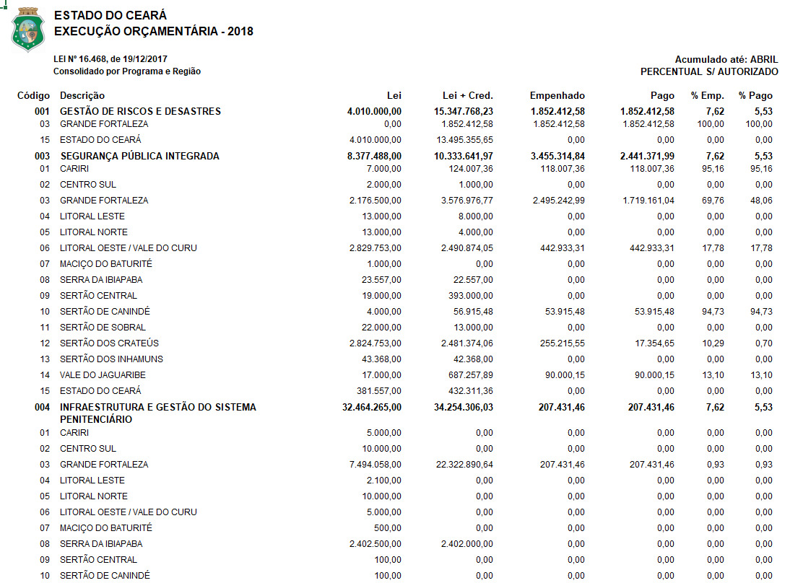
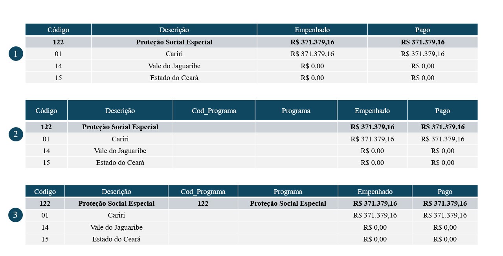
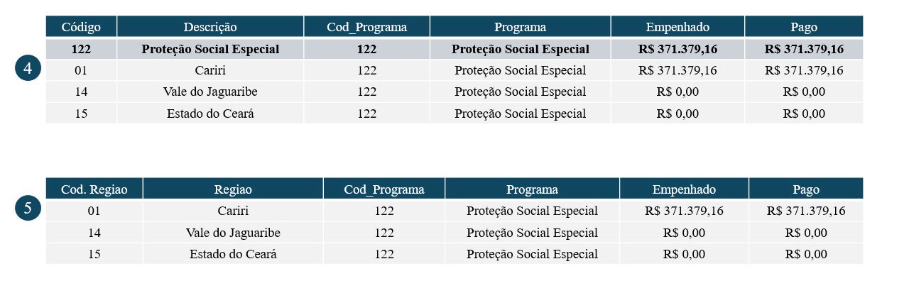

# Processamento de Dados - Investimentos Públicos por Programa e Região (Sefaz-CE)
Paulo Icaro

## Objetivo e Estrutura dos Dados

<p>

      A rotina desenvolvida visa realizar realizar a devida padronização
nos dados de investimentos por programa e/ou região que municiam os
modelos trabalhados no projeto.

      A imagem a seguir representa a estrutura dos dados
disponibilizados em cada uma das planilhas baixadas na página do
[SIOF](https://planejamento.seplag.ce.gov.br/siofconsulta/Paginas/frm_consulta_execucao.aspx).
Cada planilha representa um **Tipo** de investimento: Equipamentos,
Obras e Total. Além disso a disponibilidade efetiva das informações se
dá a partir do ano de 2016 em razão das informações no período de 2013 a
2015 não estarem disponíveis por região de planejamento. Tratado de
informações efetivas, cada planilha contém oito campos. Destes, as
colunas interesse são:

- Código
- Descrição
- Empenhado
- Pago

      No campo Código, os investimentos estão classificados em Programa
e Região. Assim cabe ao pesquisador definir como ele deseja o resultado
final: apenas Programa, apenas Região ou ambos.  
      Levando em conta os pontos mencionados e que os dados são
cumulativos, o objetivo dessa rotina é coletar as informações referentes
Programa e/ou Região considerando somente os valores de investimentos
Empenhado e Pago. Os tópicos a seguir detalham cada etapa da rotina.

</p>



## Bibliotecas e Arquivos na Pasta

<p>

      Para executação dessa rotina, duas bibliotecas foram utilizadas:

- [pandas](https://pandas.pydata.org/docs/index.html): biblioteca para
  manipulação, limpeza e análise de dados.
- [os](https://docs.python.org/3/library/os.html): biblioteca padrão do
  python que permite interagir com o sistema operacional.

      Importadas as devidas bibliotecas, os arquivos que serão
trabalhados são devidamente mapeados por meio da função **listdir** da
biblioteca **os**. Nessa etapa o usuário será questionado sobre como
deseja a estrutura final dos dados: Programa, Região ou
Programa/Região[^1].

</p>

``` python
# =================== #
# === Bibliotecas === #
# =================== #
import pandas as pd
import os
```

``` python
# ========================================= #
# === Definindo o tipo de dado desejado === #
# ========================================= #
info_desired = ''

while info_desired not in {'p', 'r', 'pr', 'rp'}:
    info_desired = input('Como você deseja a base de dados ? Use (P) para Programa, (R) para Região e (PR) para Programa e Região: ').strip().lower()
    
    if info_desired not in {'p', 'r', 'pr', 'rp'}: 
        print('Opção inválida !')
    elif info_desired == 'p':
        print('Tratando as informações por Programa ...')
        break
    elif info_desired == 'r':
        print('Tratando as informações por Região ...')
        break
    else:
        print('Tratando as informações por Programa e Região ...')
        break
```

Um *dataframe*, **dataset_full**, será gerado e irá armazenar todo o
conjunto de dados final.

``` python
# ========================== #
# ===  Arquivos de Dados === #
# ========================== #
folder_files = os.listdir('Dataset/Investimentos_Programa_Regiao/')
dataset_full = pd.DataFrame()

# --- Prints --- #
print(*folder_files[0:10], sep = '\n')
```

    MAI_2024_EQUIP.xlsx
    OUT_2022_EQUIP.xlsx
    FEV_2015_OBRAS.XLS
    JAN_2025_EQUIP.XLS
    AGO_2021_TOTAL.xlsx
    MAR_2018_EQUIP.xlsx
    DEZ_2015_EQUIP.XLS
    MAI_2017_EQUIP.xlsx
    FEV_2021_TOTAL.xlsx
    JUL_2022_TOTAL.xlsx

## Processamento de Dados

<p>

      Nesta etapa, uma estrutura *loop* é utilizada realizar a
manipulação da rotina, onde cada etapa do tratamento é executado em cada
conjunto de informações contidos nas planilhas.  
      Na leitura dos arquivos, somente as colunas de interesse são
coletadas. Além disso, toda e qualquer linha nula é removida desse
conjunto. Esse conjunto de dados remodelado recebe o nome de
**dataset**.  
      Ao **dataset** são acrescidos quatro novos campos representando,
respectivamente, i) periodo, ii) tipo de investimento, iii) ano, e iv)
mês. Tais informações são extraídas justamente do nome de cada arquivo
processado[^2]. Esse procedimento se replica nos três casos possíveis,
porém a uma pequena modificação é feita no cenário programa/região: os
campos **cod_programa** e **programa** também são incluídos.  
      Após esses tratamentos iniciais, algumas linhas de comando são
responsáveis por duas partes cruciais do procedimento. Para cada cenário
um procedimento é adotado:

- **Investimentos por Programa**: As linhas que remetem a região de
  planjamento possuem dois caracteres. Assim, todas estas são
  identificadas e depois removidas do **dataset**, restando desse modo
  somente as informações referentes aos programas;

- **Investimentos por Região**: Similar ao caso anterior, agora todas as
  linhas que representam programa é que são identificadas e removidas;

- **Programa/Região**: Aqui o ajuste é um pouco mais refinado.
  Inicialmente as linhas que representam programa são identificadas. Os
  campos **cod_programa** e **programa** são alimentados,
  respectivamente com as informações dos campos **Código** e
  **Descrição** apenas nas linhas que foram identificadas. Em seguinda,
  utilizando a função
  [**ffill**](https://pandas.pydata.org/docs/reference/api/pandas.DataFrame.ffill.html),
  as colunas **cod_programa** e **programa** de todas as linhas que por
  eliminação representam região, passam a receber o valor imediatamente
  anterior. Por fim, as linhas que representam programa são eliminadas.
  A imagem a seguir ajuda a entender o procedimento adotado:




**Cada planilha que passa por esse procedimento representa um dataset
que contribui para um dataframe final chamado dataset_full contendo
todas as informações por ano, mês e tipo de investimento e função**.
</p>

``` python
# ============================== #
# === Processamento de Dados === #
# ============================== #
for x in range(len(folder_files)):  
    
    dataset = pd.read_excel(io = 'Dataset/Investimentos_Programa_Regiao/' + folder_files[x],
                          header = 10,
                          usecols= 'C, F, K, N',
                          names = ['codigo', 'descricao', 'empenhado', 'pago'],
                          dtype = {'codigo':str})
    dataset = dataset.dropna()
    
    
    # ---------------- #
    # --- Programa --- #
    # ---------------- #
    if info_desired == 'p':
        dataset = dataset.assign(periodo = folder_files[x][0:8],
                                 tipo = folder_files[x][9:14],
                                 ano = folder_files[x][4:8],
                                 mes = folder_files[x][0:3])    
        
        # --- Substituições --- #
        replacements = {'JAN':'01', 'FEV':'02', 'MAR':'03', 'ABR':'04', 'MAI':'05', 'JUN':'06', 'JUL':'07', 'AGO':'08', 'SET':'09', 'OUT':'10', 'NOV':'11', 'DEZ':'12'}
        for old, new in replacements.items():
            dataset['mes'] = dataset['mes'].replace(old,new)
        
        # --- Identificando linhas de Região --- #
        program_flag = dataset['codigo'].str.len() == 2            
        
        # --- Removendo casos onde a coluna codigo possui 2 caracteres --- #
        dataset = dataset[~program_flag]
        
        # --- Reordenando e renomeando --- #
        dataset = dataset.reindex(columns = ['periodo', 'ano', 'mes', 'tipo', 'codigo', 'descricao', 'empenhado', 'pago'])
        dataset.rename(columns = {'descricao':'programa', 'codigo':'cod_programa'}, inplace = True)
        
        
        
    # -------------- #
    # --- Região --- #
    # -------------- #
    if info_desired == 'r':
        dataset = dataset.assign(periodo = folder_files[x][0:8],
                                 tipo = folder_files[x][9:14],
                                 ano = folder_files[x][4:8],
                                 mes = folder_files[x][0:3])    
        
        # --- Substituições --- #
        replacements = {'JAN':'01', 'FEV':'02', 'MAR':'03', 'ABR':'04', 'MAI':'05', 'JUN':'06', 'JUL':'07', 'AGO':'08', 'SET':'09', 'OUT':'10', 'NOV':'11', 'DEZ':'12'}
        for old, new in replacements.items():
            dataset['mes'] = dataset['mes'].replace(old,new)        
        
        # --- Identificando linhas de Programa --- #
        region_flag = dataset['codigo'].str.len() == 3        
        
        # --- Removendo casos onde a coluna código possui 3 caracteres --- #
        dataset = dataset[~region_flag]
        
        # --- Reordenando e renomeando --- #
        dataset = dataset.reindex(columns = ['periodo', 'ano', 'mes', 'tipo', 'codigo', 'descricao', 'empenhado', 'pago'])
        dataset.rename(columns = {'descricao':'regiao', 'codigo':'cod_regiao'}, inplace = True)

        
        
    # --------------------------- #
    # --- Programa and Região --- #
    # --------------------------- #        
    if info_desired == 'rp' or info_desired == 'pr':        
        dataset = dataset.assign(cod_programa = None, 
                                 programa = None,                                                                 # Add empty column programa
                                 periodo = folder_files[x][0:8],
                                 tipo = folder_files[x][9:14],
                                 ano = folder_files[x][4:8],
                                 mes = folder_files[x][0:3])
        
        # --- Substituições --- #
        replacements = {'JAN':'01', 'FEV':'02', 'MAR':'03', 'ABR':'04', 'MAI':'05', 'JUN':'06', 'JUL':'07', 'AGO':'08', 'SET':'09', 'OUT':'10', 'NOV':'11', 'DEZ':'12'}
        for old, new in replacements.items():
            dataset['mes'] = dataset['mes'].replace(old,new)            
    
        # --- Identificando linhas de Programa --- #
        program_flag = dataset['codigo'].str.len() == 3        
        
        # --- Preenchendo colunas --- #
        dataset.loc[program_flag, 'cod_programa'] = dataset['codigo']
        dataset.loc[program_flag, 'programa'] = dataset['descricao']
        dataset[['cod_programa','programa']] = dataset[['cod_programa','programa']].ffill()        
            
        # --- Removendo casos onde a coluna código possui 3 caracteres --- #
        dataset = dataset[~program_flag]
    
        # --- Reordenando e renomeando --- #
        dataset = dataset.reindex(columns = ['periodo', 'ano', 'mes', 'tipo', 'codigo', 'descricao', 'cod_programa', 'programa', 'empenhado', 'pago'])
        dataset.rename(columns = {'descricao':'regiao', 'codigo':'cod_regiao'}, inplace = True)
        
        
    

    # --------------------------- #    
    # --- Empilhando os dados --- #
    # --------------------------- #
    if x == 0:    
        dataset_full = dataset
    else:
        dataset_full = pd.concat([dataset_full, dataset])


# --- Prints --- #
print(dataset_full.loc[:, ~dataset_full.columns.isin(['regiao', 'programa'])].head(10))
```

         periodo   ano mes   tipo cod_regiao cod_programa  empenhado  pago
    2   MAI_2024  2024  05  EQUIP         03          101        0.0   0.0
    3   MAI_2024  2024  05  EQUIP         15          101        0.0   0.0
    6   MAI_2024  2024  05  EQUIP         15          102        0.0   0.0
    8   MAI_2024  2024  05  EQUIP         01          112        0.0   0.0
    9   MAI_2024  2024  05  EQUIP         02          112        0.0   0.0
    10  MAI_2024  2024  05  EQUIP         03          112        0.0   0.0
    11  MAI_2024  2024  05  EQUIP         04          112        0.0   0.0
    12  MAI_2024  2024  05  EQUIP         05          112        0.0   0.0
    13  MAI_2024  2024  05  EQUIP         06          112        0.0   0.0
    14  MAI_2024  2024  05  EQUIP         07          112        0.0   0.0

## Ajustes para Dados Cumulativos

<p>

      Nessa seção da rotina, o objetivo principal é chegar ao
investimento efetivo que se deu em determinado período. Dessa forma, a
ideia é sempre tomar a diferença entre os periodos adotando a seguinte
regra:

</p>

$$invest_t = invest\_acum_t - invest\_acum_t-1    \qquad(t \neq 1)$$

<p>

      É interessante ressaltar que para chegar nesse cálculo o dataframe
**dataset_full** precisa estar devidamente ordenado, evitando assim
variações entre períodos, tipos de investimento programas e regiões
diferentes. Em vista dessa necessidade, a função
[**sort_values**](https://pandas.pydata.org/docs/reference/api/pandas.DataFrame.sort_values.html)
desempenha esse papel de ordenamento a depender do cenário selecionado
pelo pesquisador:

- **Investimentos por Programa**: Código do Programa, Tipo, Ano e Mês;

- **Investimentos por Região**: Código da Região, Tipo, Ano e Mês;

- **Programa/Região**: Tipo, Código da Região, Código do Programa, Ano e
  Mês;

No **dataset_full** duas novas colunas representando o investimento
mensal, **empenhado_mensal** e **pago_mensal**, são adicionadas, ao
passo que os campos **empenhado** e **pago** passam a se chamar
**empenhado_acumulado** e **pago_acumulado**.

      Para valores que representam o mês de janeiro, uma regra em
looping foi gerada. Uma vez que os dados estão devidamente ordenados e
não há possibilidade alguma de conflito de informações, ao comparar a
linha atual com a anterior, se a diferença entre os meses for superior a
1, então tem-se a confirmação de um cenário onde a linha atual
representa janeiro e a linha anterior representa dezembro do ano
anterior. Nesse caso, a rotina entende que o valor mensal é o mesmo
valor acumulado. Nos demais cenários a regra padrão é adotada. O
infográfico a seguir ajuda a compreender a regra adotada.


</p>

``` python
# ======================================= #
# === Ajustes para Dados Cumulativos  === #
# ======================================= #

# --- Ordenamento --- #
if info_desired == 'p':
    dataset_full = dataset_full.sort_values(by = ['cod_programa', 'tipo', 'ano', 'mes']).reset_index(drop = True)
elif info_desired == 'r':
    dataset_full = dataset_full.sort_values(by = ['cod_regiao', 'tipo', 'ano', 'mes']).reset_index(drop = True)
else:
    dataset_full = dataset_full.sort_values(by = ['tipo', 'cod_regiao', 'cod_programa','ano', 'mes']).reset_index(drop = True)


# --- Ajuste nos dados cumulativos --- #
dataset_full['empenhado_mensal'] = dataset_full['empenhado'] - dataset_full['empenhado'].shift(1)     # Inserting adjusted values
dataset_full['pago_mensal'] = dataset_full['pago'] - dataset_full['pago'].shift(1)                    # Inserting adjusted values


# --- Looping de ajuste para valores com datas truncadas --- #
for i in range(len(dataset_full)):  
    if i == 0:
        dataset_full.loc[0, 'empenhado_mensal'] = dataset_full.loc[0, 'empenhado']
        dataset_full.loc[0, 'pago_mensal'] = dataset_full.loc[0, 'pago']
    if i != 0 and int(dataset_full.loc[i, 'mes']) - int(dataset_full.loc[i-1, 'mes']) != 1:
        dataset_full.loc[i, 'empenhado_mensal'] = dataset_full.loc[i, 'empenhado']
        dataset_full.loc[i, 'pago_mensal'] = dataset_full.loc[i, 'pago']
    
    
# --- Renomeando colunas --- #
dataset_full.rename(columns = {'empenhado':'empenhado_acumulado', 'pago':'pago_acumulado'}, inplace = True)


# --- Prints --- #
print(dataset_full.loc[:, ~dataset_full.columns.isin(['regiao', 'programa'])].head(10))
```

        periodo   ano mes   tipo cod_regiao cod_programa  empenhado_acumulado  \
    0  JUN_2012  2012  06  EQUIP         01          001                 0.00   
    1  JUL_2012  2012  07  EQUIP         01          001                 0.00   
    2  AGO_2012  2012  08  EQUIP         01          001                 0.00   
    3  SET_2012  2012  09  EQUIP         01          001                 0.00   
    4  OUT_2012  2012  10  EQUIP         01          001                 0.00   
    5  NOV_2012  2012  11  EQUIP         01          001                 0.00   
    6  DEZ_2012  2012  12  EQUIP         01          001                 0.00   
    7  JUN_2012  2012  06  EQUIP         01          003          16516129.06   
    8  JUL_2012  2012  07  EQUIP         01          003          29763440.90   
    9  AGO_2012  2012  08  EQUIP         01          003          29763440.90   

       pago_acumulado  empenhado_mensal  pago_mensal  
    0            0.00              0.00         0.00  
    1            0.00              0.00         0.00  
    2            0.00              0.00         0.00  
    3            0.00              0.00         0.00  
    4            0.00              0.00         0.00  
    5            0.00              0.00         0.00  
    6            0.00              0.00         0.00  
    7     16516129.06       16516129.06  16516129.06  
    8     25005350.58       13247311.84   8489221.52  
    9     29336897.53              0.00   4331546.95  

## Armazenamento dos Resultados

      Após todo o tratamento aplicado aos dados, a base final,
**dataset_full**, recebe um último tratamento antes dos dados serem
finalmente armazenados em um arquivo excel (.xlsx).  
      **A base de dados final passa por uma espécie de
“verticalização”[^3] das informações**. As colunas de valores agora são
dividídas em duas colunas. Enquanto os valores em si se alinham sob uma
única coluna nomeada **valor**, uma coluna nomeada **categoria** é
gerada para representar a categoria de investimento que está sendo
tratada. Os campos período, ano, mês, tipo, código do programa,
programa, código da região e região permanecem como variáveis
categóricas.  
      Ao final da rotina é realizada uma limpeza no *enviroment*
mantendo somente o dataframe final para visualização.

``` python
# ==================================== #
# === Armazenamento dos Resultados === #
# ==================================== #
if info_desired == 'p':       
    
    # --- Ajuste vertical na estrutura dos dados --- #
    dataset_full = dataset_full.melt(
        id_vars = ['periodo', 'ano', 'mes', 'tipo', 'cod_programa', 'programa'],
        value_vars = ['empenhado_acumulado', 'pago_acumulado', 'empenhado_mensal', 'pago_mensal'],
        var_name = 'categoria',
        value_name = 'valor'
        )
    
    # --- Armazenando --- #
    with pd.ExcelWriter(path = 'investimentos_siof_ceara_programa.xlsx', engine='xlsxwriter') as writer:
        dataset_full.to_excel(excel_writer = writer, sheet_name = 'investimentos_programa', index = False)

        # Rápida formatação na planilha
        workbook = writer.book
        worksheet = writer.sheets['investimentos_programa']
        money_formatting = workbook.add_format({'num_format':'R$#,##0'})
        perc_formatting = workbook.add_format({'num_format':'0.0%'})
        worksheet.set_column('H:H', 15, money_formatting)
        #worksheet.set_column('K:L', 15, perc_formatting)
        #worksheet.set_column('A:F', 15)
    
    # --- Limpeza --- #
    del(dataset, folder_files, i, info_desired, writer, x, new, old, replacements, program_flag)#, money_formatting, perc_formatting, workbook, worksheet)
    
elif info_desired == 'r':       
    
    # --- Ajuste vertical na estrutura dos dados --- #
    dataset_full = dataset_full.melt(
        id_vars = ['periodo', 'ano', 'mes', 'tipo', 'cod_regiao', 'regiao'],
        value_vars = ['empenhado_acumulado', 'pago_acumulado', 'empenhado_mensal', 'pago_mensal'],
        var_name = 'categoria',
        value_name = 'valor'
        )
    
    # --- Armazenando --- #
    with pd.ExcelWriter(path = 'investimentos_siof_ceara_regiao.xlsx', engine='xlsxwriter') as writer:
        dataset_full.to_excel(excel_writer = writer, sheet_name = 'investimentos_regiao', index = False)

        # Rápida formatação na planilha
        workbook = writer.book
        worksheet = writer.sheets['investimentos_regiao']
        money_formatting = workbook.add_format({'num_format':'R$#,##0'})
        perc_formatting = workbook.add_format({'num_format':'0.0%'})
        worksheet.set_column('H:H', 15, money_formatting)
        #worksheet.set_column('K:L', 15, perc_formatting)
        #worksheet.set_column('A:F', 15)
    
    # --- Limpeza --- #
    del(dataset, folder_files, i, info_desired, writer, x, new, old, replacements, region_flag)#, money_formatting, perc_formatting, workbook, worksheet)


else:
    
    # --- Ajuste vertical na estrutura dos dados --- #
    dataset_full = dataset_full.melt(
        id_vars = ['periodo', 'ano', 'mes', 'tipo', 'cod_regiao', 'regiao', 'cod_programa', 'programa'],
        value_vars = ['empenhado_acumulado', 'pago_acumulado', 'empenhado_mensal', 'pago_mensal'],
        var_name = 'categoria',
        value_name = 'valor'
        )
    
    
    # --- Armazenando --- #
    with pd.ExcelWriter(path = 'investimentos_siof_ceara_programa_regiao.xlsx', engine='xlsxwriter') as writer:
        dataset_full.to_excel(excel_writer = writer, sheet_name = 'investimentos_programa_regiao', index = False)

        # Rápida formatação na planilha
        workbook = writer.book
        worksheet = writer.sheets['investimentos_programa_regiao']
        money_formatting = workbook.add_format({'num_format':'R$#,##0'})
        perc_formatting = workbook.add_format({'num_format':'0.0%'})
        worksheet.set_column('H:H', 15, money_formatting)
        #worksheet.set_column('K:L', 15, perc_formatting)
        #worksheet.set_column('A:F', 15)
    
    # --- Limpeza --- #
    del(dataset, folder_files, i, info_desired, writer, x, new, old, replacements, program_flag)
```

[^1]: É válido mencionar que o usuário deve preencher corretamente a
    informação indicado qual tipo de análise deseja realizar. Caso
    contrário, a rotina acarretará em um erro.

[^2]: A padronização dos nomes dos arquivos é ponto crucial na distinção
    das informações. Por exemplo, para os investimentos em Equipamentos
    no período de Março de 2020, teria-se **MAR_2020_EQUIP.xlsx**.

[^3]: Esse procedimento é realizado por meio da função
    [**melt**](https://pandas.pydata.org/docs/reference/api/pandas.melt.html).
