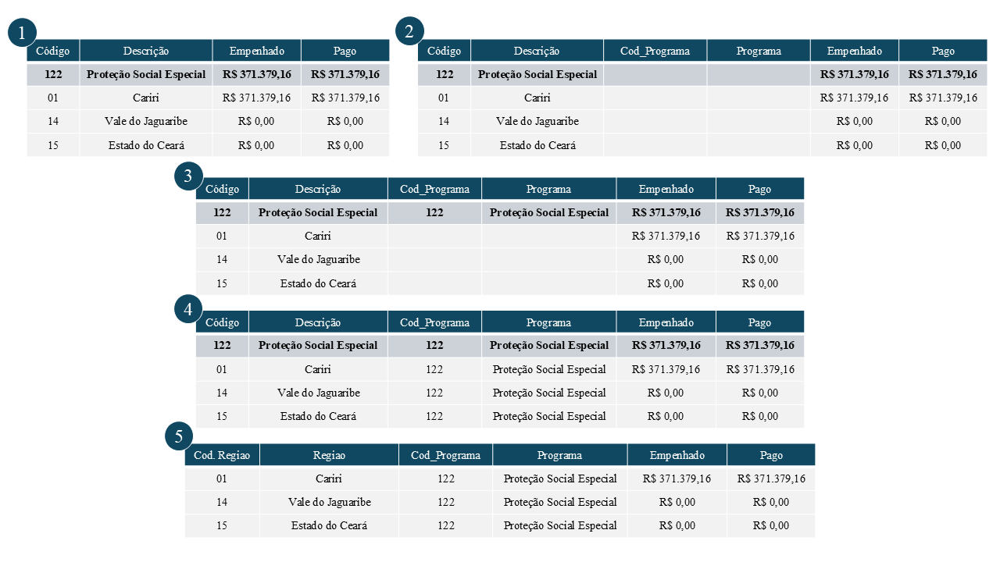

## Objetivo e Estrutura dos Dados

<p>
|       A rotina desenvolvida visa realizar realizar a devida padronização nos dados de investimentos por programa e/ou região que municiam os modelos trabalhados no projeto. 

|       A imagem a seguir representa a estrutura dos dados disponibilizados em cada uma das planilhas baixadas na página do [SIOF](https://planejamento.seplag.ce.gov.br/siofconsulta/Paginas/frm_consulta_execucao.aspx). Cada planilha representa um **Tipo** de investimento: Equipamentos, Obras e Total. Além disso a disponibilidade efetiva das informações se dá a partir do ano de 2016 em razão das informações no período de 2013 a 2015 não estarem disponíveis por região de planejamento. Tratado de informações efetivas, cada planilha contém oito campos. Destes, as colunas interesse são:
*   Código
*   Descrição
*   Empenhado
*   Pago

No campo Código, os investimentos estão classificados em Programa e Região. Assim cabe ao pesquisador definir como ele deseja o resultado final: apenas Programa, apenas Região ou ambos.

|       Levando em conta os pontos mencionados e que os dados são cumulativos, o objetivo dessa rotina é coletar as informações referentes Programa e/ou Região considerando somente os valores de investimentos Empenhado e Pago.


Os tópicos a seguir detalham cada etapa da rotina.
</p>


## Bibliotecas e Arquivos na Pasta

<p>
|       Para executação dessa rotina, duas bibliotecas foram utilizadas:

*       [pandas](https://pandas.pydata.org/docs/index.html): bilbioteca para manipulação, limpeza e análise de dados.
*       [os](https://docs.python.org/3/library/os.html): biblioteca padrão do python que permite interagir com o sistema operacional.

|       Importadas as devidas bibliotecas, os arquivos que serão trabalhados são devidamente mapeados por meio da função **listdir** da biblioteca **os**. Nessa etapa o usuário será questionado sobre como deseja a estrutura final dos dados: Programa, Região ou Programa/Região. 

</p>
```{python}
#| label: Bibliotecas e Arquivos - Parte 1
#| echo: True
#| eval: True

# =================== #
# === Bibliotecas === #
# =================== #
import pandas as pd
import os
```


```{python}
#| label: Bibliotecas e Arquivos - Parte 2
#| echo: True
#| eval: False

# ================================== #
# === Defining the data you want === #
# ================================== #
info_desired = ''

while info_desired not in {'p', 'r', 'pr', 'rp'}:
    info_desired = input('Como você deseja a base de dados ? Use (P) para Programa, (R) para Região e (PR) para Programa e Região: ').strip().lower()
    
    if info_desired not in {'p', 'r', 'pr', 'rp'}: 
        print('Opção inválida !')
    elif info_desired == 'p':
        print('Tratando as informações por Programa ...')
        break
    elif info_desired == 'r':
        print('Tratando as informações por Região ...')
        break
    else:
        print('Tratando as informações por Programa e Região ...')
        break
```


Um *dataframe*, **dataset_full**, será gerado e irá armazenar todo o conjunto de dados final.

```{python}
#| label: Bibliotecas e Arquivos - Parte 3
#| echo: True
#| eval: True


# ===================== #
# === Dataset Files === #
# ===================== #
folder_files = os.listdir('Dataset/Investimentos_Programa_Regiao/')
dataset_full = pd.DataFrame()

# --- Prints --- #
print(*folder_files[0:10], sep = '\n')
```


## Processamento de Dados 

<p>
|       Nesta etapa, uma estrutura *loop* é utilizada realizar a manipulação da rotina, onde cada etapa do tratamento é executado em cada conjunto de informações contidos nas planilhas.
|       Na leitura dos arquivos, somente as colunas de interesse são coletadas. Além disso, toda e qualquer linha nula é removida desse conjunto. Esse conjunto de dados remodelado recebe o nome de **dataset**.
|       Ao **dataset** são acrescidos quatro novos campos representando, respectivamente, i) periodo, ii) tipo de investimento, iii) ano, e iv) mês. Tais informações são extraídas justamente do nome de cada arquivo processado^[A padronização dos nomes dos arquivos é ponto crucial na distinção das informações. Por exemplo, para os investimentos em Equipamentos no período de Março de 2020, teria-se **MAR_2020_EQUIP.xlsx**.]. Esse procedimento se replica nos três casos possíveis, porém a uma pequena modificação é feita no cenário programa/região: os campos **cod_programa** e **programa** também são incluídos.
|       Após esses tratamentos iniciais, algumas linhas de comando são responsáveis por duas partes cruciais do procedimento. Para cada cenário um procedimento é adotado:

* **Investimentos por Programa**: As linhas que remetem a região de planjamento possuem dois caracteres. Assim, todas estas são identificadas e depois removidas do **dataset**, restando desse modo somente as informações referentes aos programas;

* **Investimentos por Região**: Similar ao caso anterior, agora todas as linhas que representam programa é que são identificadas e removidas.

* **Programa/Região**: Aqui o ajuste é um pouco mais refinado. Inicialmente as linhas que representam programa são identificadas. Os campos **cod_programa** e **programa** são alimentados, respectivamente com as informações dos campos **Código** e **Descrição** apenas nas linhas que foram identificadas. Em seguinda, utilizando a função [**ffill**](https://pandas.pydata.org/docs/reference/api/pandas.DataFrame.ffill.html), as colunas **cod_programa** e **programa** de todas as linhas que por eliminação representam região, passam a receber o valor imediatamente anterior. Por fim, as linhas que representam programa são eliminadas. A imagem a seguir ajuda a entender o procedimento adotado:




Primeiramente, são identificas e filtradas somentes as linhas referente a cujo código corresponde a Função. Dado a estrutura de looping, a segunda parte diz respeito a regra de acumulação das informações. **Cada planilha que passa pelo procedimento rerpresenta um dataset que contribui para um dataframe final chamado dataset_full contendo todas as informações por ano, mês e tipo de investimento e função**.
</p>
